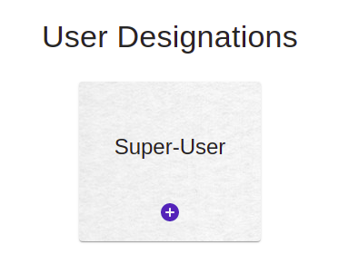

## What is User Designations?

On the user designations page, you can give a **hierarchy** to various designations of your company, as per your need. It follows an order **top to bottom** where the designation at the top (ie- Super User) has all the admin rights. The hierarchical structure forms like a tree, where the upper node acts as a parent to the lower nodes. Therefore, you can plan accordingly and provide different accesses to each designation at various levels.

## Super User

The super user is the topmost and default parent card in the hierarchy. You can add other designations (more than one) under it by clicking the blue button provided. 

## How to add a new designation?

* First, select under which designation card you want to add the new designation/s (for the first addition, it is the default superuser).
* Click on the blue button provided, a new card will appear where you can **add** the new designation **name**.
* You can **save** the changes by clicking the save button or by just hitting ENTER.
* You can also **edit** the card by clicking it.
* To **delete** the card, you can cross the red button provided on the top-right corner of the card.

