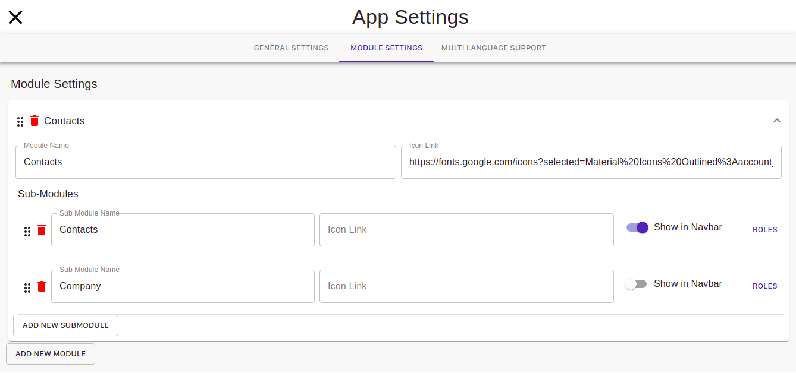
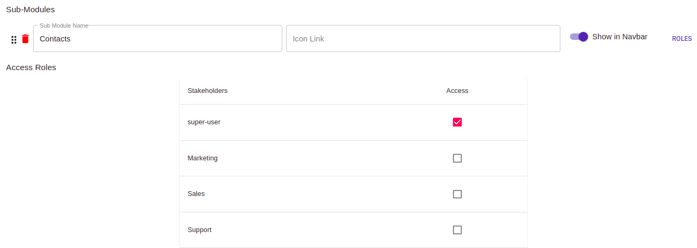

## What is app setting?

In App setting there are three subcategories namely **General setting**, **Module setting** and **Multi-language support** 
where you can redesign and recreate your modules. It is for the overall modification of modules and sub-modules according to your needs and interest.

## General setting
In the general setting, you can change the colors, name, Header, footer, and others of your website.

## Module Setting

In the *module setting*, you can modify the modules already created or even add new modules. You can also provide access according to you about each module.

### How to add new module?
* Click on the **add new module** button. A new module will get created having all the basic buttons like delete, navigation, etc.

### Editing the new module.
* You can edit the newly created module by clicking the dots icon or on the module itself. After clicking the module will open having the placeholders for Name of Module, and the icon link which you want to provide to your module so that it appears all the time in the navbar in front of it.
* You can even add submodules to the Module by clicking the **ADD NEW SUB MODULE** button. Again the placeholders will appear for the name and icon link of the submodule.
* You can even choose to have your module in the navbar or not, by clicking the *show in Navbar slider button*. If you choose it, then your module will appear in the navbar on top.
* You can also assign the **ROLES** to your submodule. On clicking the *roles* button, a card will appear having the names of designations in your company from which you can select, who have access to view or modify your modules. For example, if you check only the super user then that module will visible to the super-user and only super-user can make changes to it.

## Multi-Language support
In the multi-language support system, you can add various languages from the menu to the dashboard, in which you want the translation of your modules and submodules. By default, the language in the dashboard is "English". You can even change the default language by choosing from the menu after clicking the **DEFAULT LANGUAGE BUTTON**. After changing the default language, all your modules will be translated to the required language.

### How to add new language in which you want the translation?
* You can click on the **ADD LANGUAGE** button and select all the languages from the menu, in which you want the translations.
* After selecting the desired language option, you can click the **AUTO TRANSLATE REMAINING TEXT** button to watch the translations.
* To **remove** the added language from the dashboard, you can open the "ADD LANGUAGE" menu and can deselect the options which you do not want.

<!-- 
This is a link to [another document.](doc3.md)  
This is a link to an [external page.](http://www.example.com) -->
