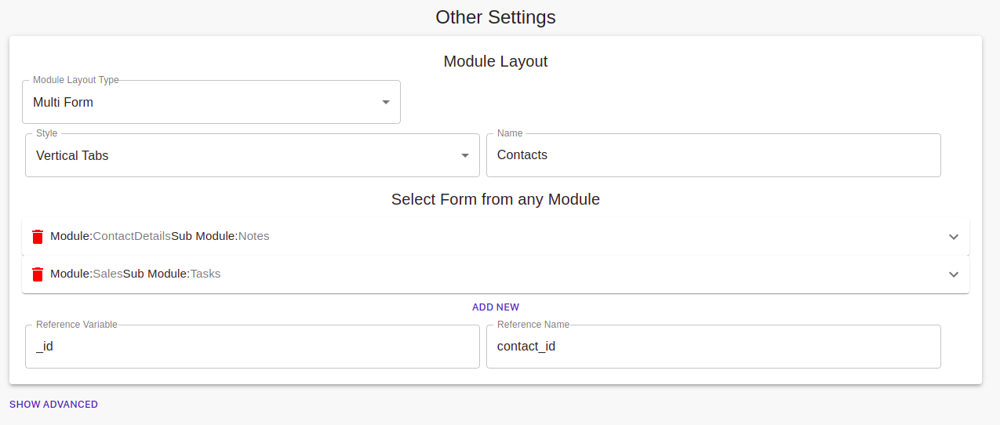

## What is Config layout?
Configuration layout describes how two-dimensional views are arranged in the dashboard and can be used for your customizations. When you save a custom layout configuration, you save the arrangement of the data in the dashboard.
In the configuration layout, you can select the module and submodule from the top and can add necessary fields to your form.
There are four subcategories in custom layout namely:- Form layout, Workflow, Settings, and Data visualizations.

## Form Layout
In the form layout, you can add all the necessary fields to your modules and submodules. You can add various data fields like name, email, mobile no, job title, company name, address etc. 
### To add a Field
* You can click on the **ADD FIELD** button to add a new field. After clicking on the button a form will appear where you can add the Name and type of the field. Also if you want you can add **validation** to the field name like a specific type etc and an error message to display if someone try to add another data type into it. 

You can also **Set Roles** to your feild like Read, create, update etc. that is you can give different access to different categories and click "save".

For eg: The owner will have all the access while the users will only have the reading access.
### To edit the saved field
* Click on the field, it will open where you can edit the Field name, Type, Validations, Error message and Roles. But the **"Key"** must not change beacause it can alter the location of data in website.

### To delete the field
* you can click on the red trash bucket to delete your field.

## Work flow
In the Work flow, you can create a hierarchy of the workflow in your company. You can dive your company work into different states and can assign roles to each state. Here you can even set the access roles to each state and manage them.

### Adding the new state in work flow
* Click on the "Add new work" button to create a state in work flow. Then fill in the state name and coloum name. Click on "add new" button to add another coloum to the state. You can add as many coloumn as you want. You can also provide access roles to the state by selecting it and can even create buttons by clicking the "Add new" button and provide name and access role to the button also.
Moreover in advance settings you can add another button with some other functionality like downloading PDF etc.

### Delete the state
* To delete the state simply click on the **cross button** on the top of the state card.

## Settings
In settings, you can do many things like creating, modify, enhance and even delete the module or submodule which you want. In settings, you can select module and submodule from the top, in which you want to make changes. In settings you can do various actions like Setting roles, Create, Update, Read. You can also change the form layout. Can add a new value to the database etc.
### Set Roles
* Here you can give various types of access to different Users (Stakeholders). 
* There are four options Read, Update, Create, Delete. 
* By default, every stakeholder has **"Create"** access. This means each of them can create a new module. 
* To provide different access to different stakeholders you can select the relevant **checkboxes** in front of them.

### Create and update
* In create you can make a new form by entering the name whereas in Update you can modify any form by entering it's name.
* The **No back** button allows you to have or not, a backward navigation button on your navbar in form page.

### Read
* In Read, you can change the reading settings of your form. If you want, you can have a "filter" option according to your need and a "Download CSV" file option on your form page just by selecting the red button respectively. In the field, you can select in which order you want to see your data. You can filter your data according to different sorting methods available like Last modify, Latest, Newly added, etc.
* You can even add a new form to the module by clicking the " ADD NEW FORM" button where you can add necessary details to your form. Like Name of form, Column name, input type, Input, and also the "access" permissions to various stakeholders.
* You can delete the form by clicking the "red bucket" in the form.

### Other Settings
In other Setting, you can change the overall design of your form like layout, styling etc.
### Module Layout
* In the Module layout type, you can choose how to display your module. There are four options like Multiform, Same page CRUD, Multi-column form, Form only and none. You can choose from any of them.
    1. **Multiform:** You can add more than one form in one layout.
    2. **Same page CRUD:** Your data will be shown on the same page in a single go.
    3. **Multi column:** Your data will be shown in multi columns vertically.
    4. **Form only:** You can see your form only nothing else in the layout.
* You can change the display styling of your module too. There are two options vertical tabs and single page you can choose from.
* In Select Form from any Module, you can select any module or can even create a new one by clicking on the "Add new" button below. Here you can modify the access roles of the submodules.
* To delete the form from the module you can click on the red bucket button.
* There is a "reference variable" and a "reference name" which you can change according to your data. Be careful while dealing with "id" because it is unique for a module and if changed can alter the storing location of that field in the database.

### Advance setting
In advance, you have a database and login form
* **Database**
    * You can use the database of other modules and submodules by providing the Module name and sub-module name into your newly created module.
* **Login form**
    * You can convert any form into a login form us using this. You can even add more information to it. You can add Emailid, password, user id, and Role to the form.  

## Data visualization
Data visualization is the alter method of visualizing your data in the other ways like bar graph, pie-charts, graphs etc. If you choose to Data visualization then Form layout will not be prepared and vice-versa. 
We can create new graph where we can add Name, type, Operation code, and field name, Data range etc.
* There are many types in which data can be represented like Bar Chart, Pie, Donut, Line, Area.
* The Operation codes that can be performed are Count, Count unique, Sum, Sum of product, Average.
* You can name the unique field and can choose what to display on x-axis.
* In **Category** You can give names of categories which will be there on your graph. We can add Label name and can choose different colors for them which will be represented in the graph.
* By selecting **Filter** we can sort our data and can even apply the filter on any category in the data visualization. For eg we can apply filter like Sort the data from Day one to month end or data of half month etc.

