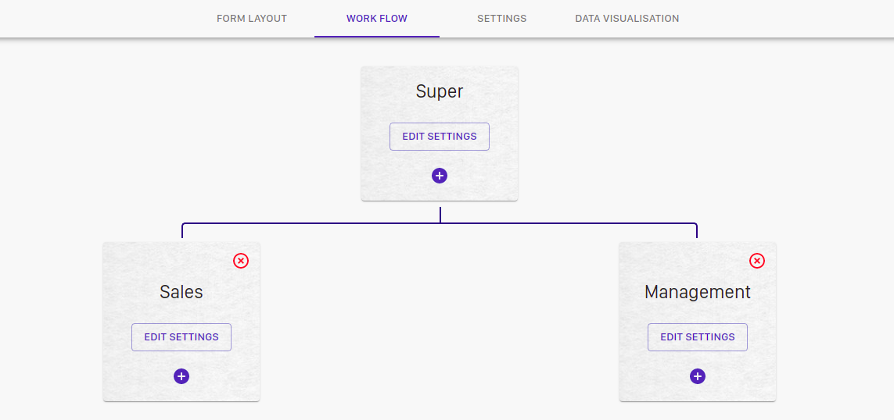

## What is Config layout?
Configuration layout describes how two-dimensional views are arranged in the dashboard and can be used for your customizations. When you save a custom layout configuration, you save the arrangement of the data in the dashboard.
In the configuration layout, you can select the module and submodule from the top and can add necessary fields to your form.
There are four subcategories in custom layout namely:- Form layout, Workflow, Settings, and Data visualizations.

### Form Layout
In the form layout, you can add all the necessary fields to your modules and submodules. You can add various data fields like name, email, mobile no, job title, company name, address etc. 
#### To add a Field
* You can click on the **ADD FIELD** button to add a new field. After clicking on the button a form will appear where you can add the Name and type of the field. Also if you want you can add **validation** to the field name like a specific type etc and an error message to display if someone try to add another data type into it. 

You can also **Set Roles** to your feild like Read, create, update etc. that is you can give different access to different categories and click "save".

For eg: The owner will have all the access while the users will only have the reading access.
#### To edit the saved field
* Click on the field, it will open where you can edit the Field name, Type, Validations, Error message and Roles. But the **"Key"** must not change beacause it can alter the location of data in website.

#### To delete the field
* you can click on the red trash bucket to delete your field.

### Work flow
In the Work flow, you can create a hierarchy of the workflow in your company. You can dive your company work into different states and can assign roles to each state. Here you can even set the access roles to each state and manage them.

#### Adding the new state in work flow
* Click on the "Add new work" button to create a state in work flow. Then fill in the state name and coloum name. Click on "add new" button to add another coloum to the state. You can add as many coloumn as you want. You can also provide access roles to the state by selecting it and can even create buttons by clicking the "Add new" button and provide name and access role to the button also.
Moreover in advance settings you can add another button with some other functionality like downloading PDF etc.

#### Delete the state
* To delete the state simply click on the **cross button** on the top of the state card.

### Settings

### Data visualization
